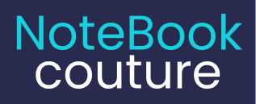

## NoteBook Couture

NoteBook Couture est une plateforme de gestion de finances et de tâches pour les couturiers.  
Projet du mois de Septembre obtenu à NaN conçu en HTML/CSS/JS avec localStorage.

https://moh7ven.github.io/NoteBook-Couture/

